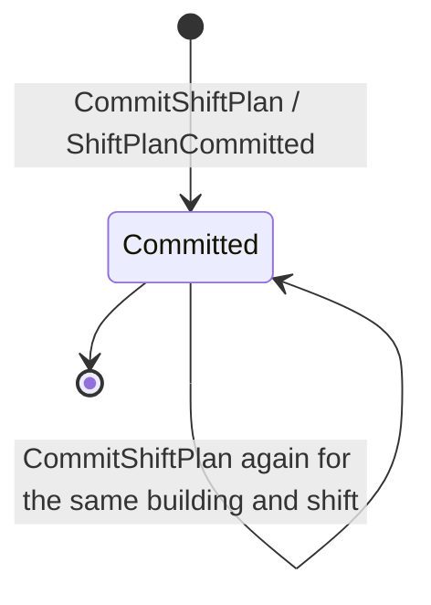
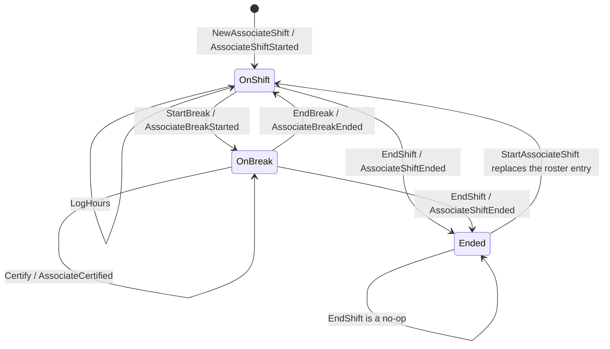
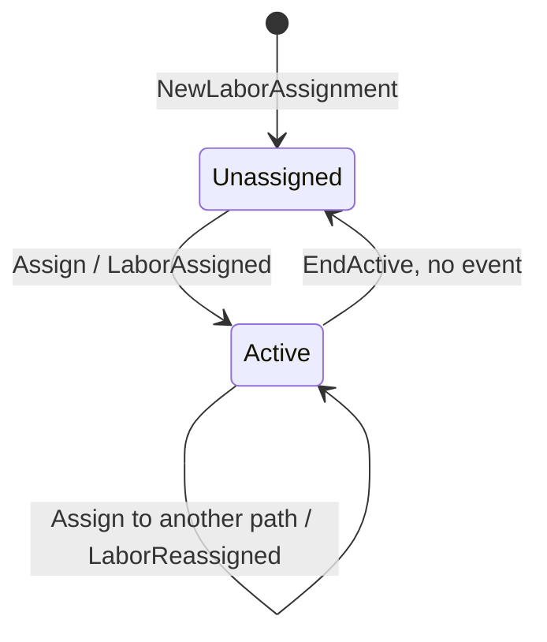

# Aggregate design canvas

Follows the ddd-crew
[Aggregate Design Canvas v1.1](https://github.com/ddd-crew/aggregate-design-canvas),
one section per aggregate root in `internal/domain/`. None of the three roots
has a status enum: state is held in booleans (`onBreak`, `ended`) or in the
presence of an optional field (`active *Interval`), so each state diagram
names the states those fields encode. Every transition label is a real method.

Throughput and size figures are **estimates** for one building running
roughly a hundred associates per shift; they are not measured.

## ShiftPlan

### 1. Name

`ShiftPlan` — `internal/domain/shiftplan/shift_plan.go`. Identity: the pair
`(buildingId, shiftId)`.

### 2. Description

The headcount split a human committed across paths for one building's shift:
a list of `PathPlan` lines (`PathId`, `PlannedHeads`, `PlannedRate`,
`PlannedHours`). It is the context's specification model — the number
downstream planners consume.

### 3. State Transitions

Source: `internal/domain/shiftplan/shift_plan.go` (`CommitShiftPlan`,
`Rehydrate`), `internal/adapters/outbound/postgres/shift_plan_repo.go`
(`Save` deletes and re-inserts the `path_plan` lines). Omits: `Rehydrate`,
which reconstructs without raising events. There is no draft state — a
proposal (`ProposedHeads`) has no aggregate identity at all.

### 4. Enforced Invariants

| Invariant | Enforced by |
| --- | --- |
| At least one `PathPlan` line | `shiftplan.ErrNoPathPlans` in `CommitShiftPlan` |
| Every line has a caller-supplied installed-station count | `shiftplan.ErrMissingInstalledStations` |
| `plannedHeads ≤ installedStations` (caller-supplied) | `shiftplan.ErrPlannedHeadsExceedInstalled` |
| `plannedHeads ≤ live installed capacity` (missing entry = 0) | `shiftplan.ErrExceedsInstalledCapacity` ([ADR 0014](../adr/0014-installed-capacity-ceiling.md)) |
| `plannedHours ≤ plannedHeads × maxHoursPerShift` | `shiftplan.ErrPlannedHoursExceedCapacity` |
| Every line's path is a declared catalogue path (application layer) | `pathcatalog.ErrUnknownPath` in `CommitShiftPlan.installedCapacityForPath` |

### 5. Corrective Policies

- None automatic. A rejected commit is corrected by the human resubmitting.
- When the live capacity read fails, the commit is rejected
  (`ports.ErrInstalledCapacityUnavailable` → 503); nothing is retried on the
  commit path ([ADR 0022](../adr/0022-resilience-circuit-breakers-retry-dlq-shutdown.md)).
- A later understaffing is surfaced by `GetStaffingGap` as `PathUnderstaffed`
  — a flag for a human, never a plan change.

### 6. Handled Commands

`CommitShiftPlan` (`POST /shift-plans`). Read by `GetStaffingGap` and by the
integration publisher's fan-out.

### 7. Created Events

- `com.warehouse.wes.workforce-management.shiftplan.ShiftPlanCommitted`

`ShiftPlanProposed` and `PathUnderstaffed` carry the `shiftplan` entity
segment in their `type` but are constructed by use cases, not by this
aggregate (see [Domain events](./domain-events.md)).

### 8. Throughput

Estimate: a handful of commits per building per shift (one at shift start,
occasional re-commits). Concurrency conflicts are not guarded: there is no
`version` column, because each commit builds a fresh plan rather than
mutating a loaded one ([ADR 0021](../adr/0021-optimistic-concurrency-version-column.md)).

### 9. Size

Estimate: one to a dozen `PathPlan` lines; one domain event per commit
(fanned out to one integration message per line). Lifetime: one shift.

## AssociateShift

### 1. Name

`AssociateShift` — `internal/domain/associate/associate_shift.go`. Identity:
`AssociateId`.

### 2. Description

One associate's roster entry for a shift: their certifications, break state,
logged hours and whether the shift ended. It answers "can this associate be
assigned right now?" (`CanBeAssigned`, `HasCertification`).

### 3. State Transitions

Source: `internal/domain/associate/associate_shift.go`,
`internal/application/usecases/start_associate_shift.go`. States encode the
fields `onBreak` and `ended`. Omits: the rejected transitions (listed as
invariants below) and the infrastructure-only `SetVersion`.

### 4. Enforced Invariants

| Invariant | Enforced by |
| --- | --- |
| No break while already on break | `associate.ErrAlreadyOnBreak` in `StartBreak` |
| No break end while not on break | `associate.ErrNotOnBreak` in `EndBreak` |
| No assignment while on break | `associate.ErrOnBreak` in `CanBeAssigned` |
| No mutation after the shift ended (certify, breaks, hours, assignment) | `associate.ErrShiftEnded` |
| Logged hours never exceed `MAX_HOURS_PER_SHIFT` | `associate.ErrMaxHoursExceeded` in `LogHours` |
| Non-empty identity and certification values | `shared.ErrEmptyAssociateId`, `shared.ErrEmptyCertification` |
| No lost update between two writers | `ports.ErrConcurrentModification` from the version-guarded `AssociateRepo.Save` (infrastructure, [ADR 0021](../adr/0021-optimistic-concurrency-version-column.md)) |

### 5. Corrective Policies

- `EndAssociateShift` closes the associate's active `LaborAssignment` and
  logs its hours before ending the shift — the one cross-aggregate policy,
  run inside one unit of work.
- Restarting (`StartAssociateShift` on an existing id) replaces the entry and
  carries over the stored `version`.

### 6. Handled Commands

`StartAssociateShift`, `CertifyAssociate`, `StartBreak`, `EndBreak`,
`EndAssociateShift`; `LogHours` is invoked by `AssignLabor` and
`EndAssociateShift` when an interval closes.

### 7. Created Events

- `com.warehouse.wes.workforce-management.associate.AssociateShiftStarted`
- `com.warehouse.wes.workforce-management.associate.AssociateCertified`
- `com.warehouse.wes.workforce-management.associate.AssociateBreakStarted`
- `com.warehouse.wes.workforce-management.associate.AssociateBreakEnded`
- `com.warehouse.wes.workforce-management.associate.AssociateShiftEnded`

### 8. Throughput

Estimate: a few writes per associate per shift (start, one or two breaks,
the occasional certification, end) plus one hours update per reassignment.

### 9. Size

Estimate: 4–8 events per instance per shift; a certification set of a few
values. Lifetime: one shift, though the row is reused across restarts.

## LaborAssignment

### 1. Name

`LaborAssignment` — `internal/domain/assignment/labor_assignment.go`.
Identity: `AssociateId` (one record per associate).

### 2. Description

Which path an associate is on now (`active *Interval`) and every closed
`Interval` before it (`history`). Keying the root by associate makes "exactly
one ACTIVE assignment per associate" structural: there is only one field to
hold it.

### 3. State Transitions

Source: `internal/domain/assignment/labor_assignment.go`. States encode
whether `active` is nil. Omits: `Rehydrate`; the closed interval moved into
`history` on every `Assign`-from-Active and `EndActive`.

### 4. Enforced Invariants

| Invariant | Enforced by |
| --- | --- |
| At most one ACTIVE assignment per associate (double-booking impossible) | structural — `Assign` closes the active interval before opening a new one |
| The associate holds the path's required certification | `assignment.ErrCertificationRequired` in `Assign` (certification resolved by `usecases.requiredCertification`) |
| Assignee is on shift and not on break (checked on the other aggregate first) | `associate.ErrOnBreak`, `associate.ErrShiftEnded` via `AssociateShift.CanBeAssigned` in `AssignLabor` |
| Path is a declared catalogue path (adapter layer) | `pathcatalog.ErrUnknownPath` in the HTTP and MCP adapters' `validatePathId` |
| No lost update between two writers | `ports.ErrConcurrentModification` from the version-guarded `AssignmentRepo.Save` |

### 5. Corrective Policies

- A second assignment never fails as "double-booked"; it is corrected by
  construction into a reassignment.
- The closed interval's hours are logged on `AssociateShift`; if that would
  exceed `MAX_HOURS_PER_SHIFT`, the whole assignment is rejected
  (`ErrMaxHoursExceeded`).

### 6. Handled Commands

`AssignLabor` (`POST /associates/{id}/assignments`, MCP `assign_labor`);
`EndActive` from `EndAssociateShift`. `CountActiveByPath` on its repository
backs `GetStaffingGap`.

### 7. Created Events

- `com.warehouse.wes.workforce-management.assignment.LaborAssigned`
- `com.warehouse.wes.workforce-management.assignment.LaborReassigned`

### 8. Throughput

Estimate: the hottest aggregate — every intra-shift move is one write, a
few per associate per shift, peaking when a shift lead rebalances.

### 9. Size

Estimate: history grows by one interval per move, so a handful to a few
dozen intervals per associate. The Postgres repo rewrites the whole history
on every `Save` (`DELETE` + re-`INSERT` into `labor_assignment_history`), so
history length is the size driver.

## Not aggregates

These hold state or raise events but have no aggregate identity:

| Thing | What it is | Where |
| --- | --- | --- |
| `ProposedHeads` / `ProposePathPlan` | pure computation that raises `ShiftPlanProposed` | `internal/domain/shiftplan`, `internal/application/usecases/propose_path_plan.go` |
| `StaffingGap` / `GetStaffingGap` | read model derived from a `ShiftPlan` and `CountActiveByPath`; raises `PathUnderstaffed` | `internal/application/usecases/get_staffing_gap.go` |
| `pathcatalog.Catalogue` | in-memory lookup of the process-path catalogue (file or Kafka-fed) | `internal/domain/pathcatalog` |
| `labor_rollup` and the `analytics_*` tables | analytics projection, written by `cmd/workforce-projector` | `migrations/analytics/0001_report.up.sql`, `internal/adapters/outbound/analyticsstore` |
| `laborperformancecache.Consumer` | per-TaskType running mean and idle share cache | `internal/adapters/outbound/laborperformancecache` |
