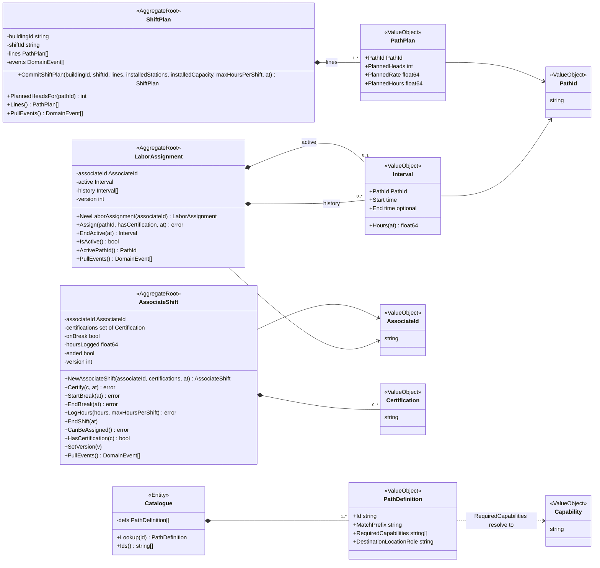
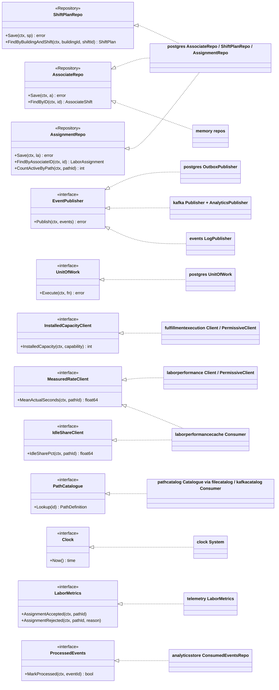
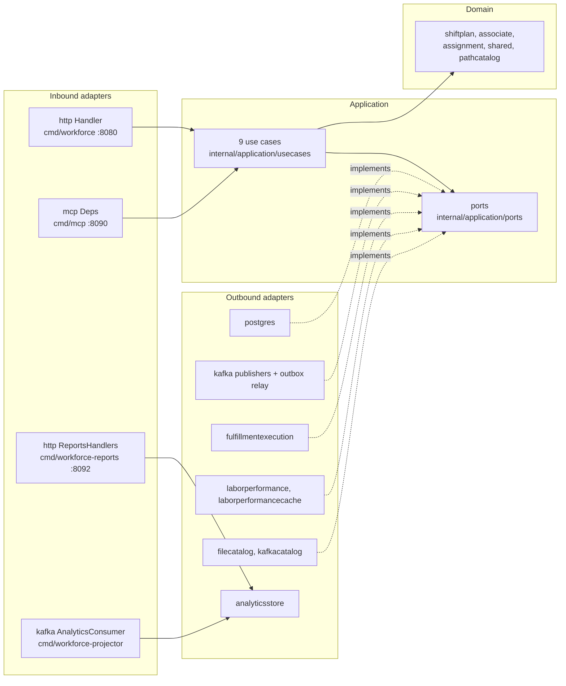

# Class diagram

UML class diagrams of `internal/domain/**`, split in three so each stays
readable: the aggregates with their value objects, the domain events, and
the hexagonal ports with their adapters. Field and method names are the real
Go identifiers; unexported fields keep their lower-case names.

## Aggregates and value objects

Source: `internal/domain/shiftplan/shift_plan.go`,
`internal/domain/associate/associate_shift.go`,
`internal/domain/assignment/labor_assignment.go`,
`internal/domain/shared/ids.go`, `internal/domain/pathcatalog/path_definition.go`.
Omits: getters that only expose a field (`BuildingId`, `ShiftId`,
`AssociateId`, `Version`, `IsOnBreak`, `HoursLogged`, `Ended`,
`Certifications`, `ActiveInterval`, `History`), every `Rehydrate`
constructor, the private `record`/`closeActive` helpers, the `New*`
validating constructors of the string value objects, and the free function
`shiftplan.ProposedHeads(charge, plannedRate)`. `Catalogue` is marked
`<<Entity>>` for want of a better stereotype: it is reference data with no
identity of its own. There are **no enumerations**: no aggregate has a status
enum. The three roots reference each other only by `AssociateId` / `PathId`
values, never by object reference.

## Domain events

```mermaid
classDiagram
    direction TB
    class DomainEvent {
        <<interface>>
        +EventName() string
        +OccurredAt() time
    }
    class ShiftPlanProposed {
        <<DomainEvent>>
        BuildingId string
        PathId PathId
        PlannedHeads int
        PlannedRate float64
    }
    class ShiftPlanCommitted {
        <<DomainEvent>>
        BuildingId string
        ShiftId string
    }
    class PathUnderstaffed {
        <<DomainEvent>>
        PathId PathId
        PlannedHeads int
        ActiveHeads int
    }
    class AssociateShiftStarted {
        <<DomainEvent>>
        AssociateId AssociateId
        Certifications Certification[]
    }
    class AssociateCertified {
        <<DomainEvent>>
        AssociateId AssociateId
        Certification Certification
    }
    class AssociateBreakStarted {
        <<DomainEvent>>
        AssociateId AssociateId
    }
    class AssociateBreakEnded {
        <<DomainEvent>>
        AssociateId AssociateId
    }
    class AssociateShiftEnded {
        <<DomainEvent>>
        AssociateId AssociateId
    }
    class LaborAssigned {
        <<DomainEvent>>
        AssociateId AssociateId
        PathId PathId
    }
    class LaborReassigned {
        <<DomainEvent>>
        AssociateId AssociateId
        FromPathId PathId
        ToPathId PathId
    }
    DomainEvent <|.. ShiftPlanProposed
    DomainEvent <|.. ShiftPlanCommitted
    DomainEvent <|.. PathUnderstaffed
    DomainEvent <|.. AssociateShiftStarted
    DomainEvent <|.. AssociateCertified
    DomainEvent <|.. AssociateBreakStarted
    DomainEvent <|.. AssociateBreakEnded
    DomainEvent <|.. AssociateShiftEnded
    DomainEvent <|.. LaborAssigned
    DomainEvent <|.. LaborReassigned
```

Source: `internal/domain/shared/events.go`. Omits: the embedded
`baseEvent` struct that carries `occurredAt`, and the `New*` constructors.
`ShiftPlanProposed` and `PathUnderstaffed` are constructed by use cases,
not aggregates.

## Ports and adapters

Source: `internal/application/ports/ports.go`, `internal/adapters/outbound/**`,
`internal/composition/*.go`, `cmd/workforce/main.go`. Omits: the inbound
side (shown below), the circuit-breaker decorators that wrap the two HTTP
clients, and the in-memory implementations of the other two repos and of
`ProcessedEvents`.

Source: `cmd/*/main.go`, `internal/adapters/**`. Omits: telemetry, clock,
bootretry and resilience packages. The analytics side (`KC`, `REP`,
`analyticsstore`) bypasses the use cases: it is a read-side projection, not
part of the domain model ([ADR 0010](../adr/0010-analytical-data-product.md)).
The dependency rule is enforced by `make arch-test`
([ADR 0007](../adr/0007-arch-go-architecture-fitness-tests.md)).
