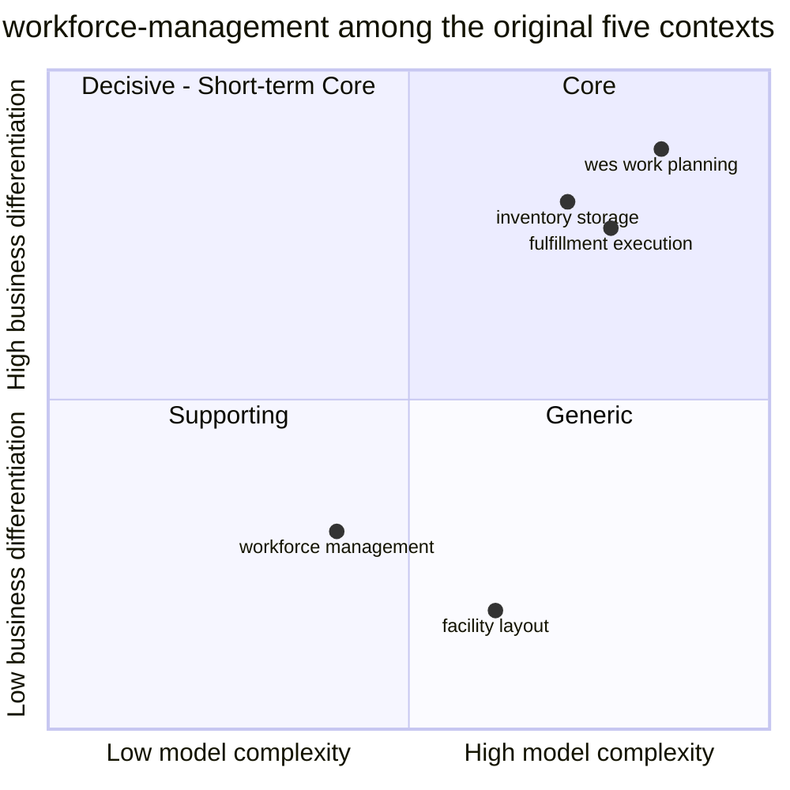

# Core domain chart

Following the ddd-crew
[Core Domain Charts](https://github.com/ddd-crew/core-domain-charts): each
subdomain is placed by **model complexity** (x) and **business
differentiation** (y). The classification is not decided here — it is the one
already recorded in [Subdomain classification](./subdomain-classification.md):
**workforce-management is Supporting**. This chart only shows where inside the
Supporting quadrant it sits, and why.

Source: classification from `docs/docs/ddd/subdomain-classification.md`
(table "The original five contexts, for comparison"); this context's position
from `internal/domain/**` (aggregate and invariant count) and
`docs/docs/adr/*.md`. Omits: the six later fleet contexts (their
classifications are owned by their own repositories), and any numeric
precision — the coordinates are relative placements, not measurements.

Quadrant numbering follows Mermaid: 1 = top-right (Core), 2 = top-left
(Decisive / Short-term Core), 3 = bottom-left (Supporting), 4 = bottom-right
(Generic). The four sibling points are shown only for scale, using the
classifications this repository's own subdomain page assigns them.

## Why this position

**Differentiation: low (y ≈ 0.3).** The fulfillment DDD reference calls labor
management "important, industry-common". Nothing in this codebase is an
optimiser, a heuristic or a scoring function; rebalancing is a human decision
that this context only records ([ADR 0002](../adr/0002-stop-at-the-path-boundary.md)).
The platform differentiates in `wes-work-planning` (continuous release and
flow balancing), `inventory-storage` and `fulfillment-execution`, not here.

**Complexity: moderate, below the midpoint (x ≈ 0.4).** Evidence from the
code:

| Signal | Value | Where |
| --- | --- | --- |
| Aggregate roots | 3 — `AssociateShift`, `ShiftPlan`, `LaborAssignment` | `internal/domain/{associate,shiftplan,assignment}` |
| Domain invariants enforced in pure Go | 11 rejecting errors across the three roots, 4 of them named in the Definition of Done | [Invariants](./invariants.md), [Aggregate design canvas](./aggregate-design-canvas.md) |
| Status enums / state machines | none — state is two booleans (`onBreak`, `ended`) and one optional interval | `associate_shift.go`, `labor_assignment.go` |
| Cross-context reads that shape a decision | 2 — live installed capacity (fail-loud) and measured rate / idle share (fail-open) | [ADR 0014](../adr/0014-installed-capacity-ceiling.md), [ADR 0012](../adr/0012-measured-rate-feed-for-propose-path-plan.md), [ADR 0020](../adr/0020-idle-share-staffing-signal.md) |
| ADRs | 32 — most about integration and operability, not domain modelling | [ADR index](../adr/index.md) |

The complexity that exists is about **correctness** (structural single active
assignment, two independent capacity ceilings, certification gating), not
about a rich or novel model. That is what keeps it left of the midpoint while
still above the trivial corner.

## Supporting, not Generic

A Generic subdomain is one you could buy. This one is too tied to the
platform's process-path vocabulary — path families resolved by prefix through
the process-path catalogue, path-name-equals-certification-name gating,
installed capacity counted per station **capability** — for an off-the-shelf
labor product to fit without a translation layer wider than the service
itself. That is the same argument [Subdomain classification](./subdomain-classification.md)
makes, and why the point stays in quadrant 3 rather than drifting right.

## Evolution

On the Wardley evolution axis (genesis → custom-built → product → commodity)
this context is **product**: labor allocation against a fixed path catalogue
is a well-understood problem, solved the same way across the industry, and the
investment here goes into enforcing well-known rules correctly. Two parts are
closer to **custom-built**: the idle-share proposal trim
([ADR 0020](../adr/0020-idle-share-staffing-signal.md)) and the live
installed-capacity ceiling ([ADR 0014](../adr/0014-installed-capacity-ceiling.md)),
both specific to how this fleet wires its contexts together. Neither moves
the context out of Supporting; they make it a better-fitting Supporting
context.

## What would move it

- An automated rebalancer (an `AssignmentOptimizer` in the reference model's
  terms) would raise both differentiation and complexity and push the point
  toward quadrant 1. [Context relationships](./context-relationships.md)
  names this as the first relationship that would need revisiting.
- Replacing the process-path vocabulary with a generic skills/roster model
  would push it toward quadrant 4.
