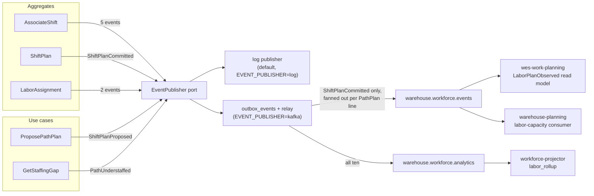

# Domain events

Ten events, all past tense, all implementing
`shared.DomainEvent` (`EventName() string`, `OccurredAt() time.Time`). Their
names are fixed vocabulary — they appear verbatim in the Go code, in
`apis/asyncapi.yaml`, and in this documentation.

## The catalog

| Event | Raised by | When | Payload |
| --- | --- | --- | --- |
| `ShiftPlanProposed` | `ProposePathPlan` use case | Heads were computed for a path, ahead of any commit | `buildingId`, `pathId`, `plannedHeads`, `plannedRate` |
| `ShiftPlanCommitted` | `ShiftPlan` | A human committed the headcount split | `buildingId`, `shiftId` |
| `AssociateShiftStarted` | `AssociateShift` | A roster entry opened | `associateId`, `certifications` |
| `AssociateCertified` | `AssociateShift` | A certification was added | `associateId`, `certification` |
| `AssociateBreakStarted` | `AssociateShift` | A logged break began | `associateId` |
| `AssociateBreakEnded` | `AssociateShift` | A logged break ended | `associateId` |
| `LaborAssigned` | `LaborAssignment` | An associate was placed on a path (first assignment) | `associateId`, `pathId` |
| `LaborReassigned` | `LaborAssignment` | An active assignment was closed in favour of another path | `associateId`, `fromPathId`, `toPathId` |
| `PathUnderstaffed` | `GetStaffingGap` use case | Active assignments fell short of committed heads | `pathId`, `plannedHeads`, `activeHeads` |
| `AssociateShiftEnded` | `AssociateShift` | A shift closed, ending all active assignments | `associateId` |

## Wire catalog

Every event is a CloudEvents 1.0 **structured-mode** message
(`content-type: application/cloudevents+json; charset=UTF-8`), built only by
`internal/adapters/kafka/cloudevents.New`. `type` and `dataschema` come from
`internal/adapters/kafka/cloudevents/types.go`; topics, keys and `data`
fields from `internal/adapters/outbound/kafka/publisher.go` (integration) and
`analytics_publisher.go` (analytics). `dataschema` is
`urn:warehouse:workforce-management:<events|analytics>:<EventName>:v1`.

| Full CloudEvents `type` | Topic | Kafka key / `subject` | `data` fields | Producer use case | Known consumers |
| --- | --- | --- | --- | --- | --- |
| `com.warehouse.wes.workforce-management.shiftplan.ShiftPlanCommitted` | `warehouse.workforce.events` (one message per `PathPlan` line) | `<buildingId>/<shiftId>` / same | `building_id`, `shift_id`, `path_id`, `planned_heads`, `planned_rate`, `planned_hours` | `CommitShiftPlan` | `wes-work-planning` (`LaborPlanObserved`), `warehouse-planning` (group `warehouse-planning-labor-capacity`) |
| `com.warehouse.wes.workforce-management.shiftplan.ShiftPlanCommitted` | `warehouse.workforce.analytics` (one per commit) | `<buildingId>` / `<buildingId>/<shiftId>` | `building_id`, `shift_id` | `CommitShiftPlan` | acknowledged, not projected, by `cmd/workforce-projector` |
| `com.warehouse.wes.workforce-management.shiftplan.ShiftPlanProposed` | `warehouse.workforce.analytics` | `<pathId>` / same | `building_id`, `path_id`, `planned_heads`, `planned_rate` | `ProposePathPlan` | acknowledged, not projected |
| `com.warehouse.wes.workforce-management.shiftplan.PathUnderstaffed` | `warehouse.workforce.analytics` | `<pathId>` / same | `path_id`, `planned_heads`, `active_heads` | `GetStaffingGap` | `cmd/workforce-projector` → `labor_rollup.understaffing_events` |
| `com.warehouse.wes.workforce-management.associate.AssociateShiftStarted` | `warehouse.workforce.analytics` | `<associateId>` / same | `associate_id` | `StartAssociateShift` | projector → `shifts_started` |
| `com.warehouse.wes.workforce-management.associate.AssociateCertified` | `warehouse.workforce.analytics` | `<associateId>` / same | `associate_id`, `certification` | `CertifyAssociate` | projector → `certifications` |
| `com.warehouse.wes.workforce-management.associate.AssociateBreakStarted` | `warehouse.workforce.analytics` | `<associateId>` / same | `associate_id` | `StartBreak` | projector → `breaks`, `analytics_pending_breaks` |
| `com.warehouse.wes.workforce-management.associate.AssociateBreakEnded` | `warehouse.workforce.analytics` | `<associateId>` / same | `associate_id` | `EndBreak` | projector → `break_seconds` |
| `com.warehouse.wes.workforce-management.associate.AssociateShiftEnded` | `warehouse.workforce.analytics` | `<associateId>` / same | `associate_id` | `EndAssociateShift` | projector → `shifts_ended` |
| `com.warehouse.wes.workforce-management.assignment.LaborAssigned` | `warehouse.workforce.analytics` | `<associateId>` / same | `associate_id`, `path_id` | `AssignLabor` | projector → `labor_assigned` |
| `com.warehouse.wes.workforce-management.assignment.LaborReassigned` | `warehouse.workforce.analytics` | `<associateId>` / same | `associate_id`, `from_path_id`, `to_path_id` | `AssignLabor` | projector → `labor_reassigned` (bucketed under `to_path_id`) |

The analytics `data` payloads are deliberately thinner than the domain
events: `AssociateShiftStarted` drops the certification list. The analytics
consumer (group `workforce-analytics`) dedupes on the CloudEvents `id`,
ignores unknown types, and sends anything that fails CloudEvents validation
or exhausts its retries to `warehouse.workforce.analytics.dlq`
([ADR 0022](../adr/0022-resilience-circuit-breakers-retry-dlq-shutdown.md)).

### Events this context consumes

| Full CloudEvents `type` | Topic | Consumer | Enabled by |
| --- | --- | --- | --- |
| `com.warehouse.wes.process-path-management.processpath.ProcessPathCreated` | `warehouse.process-path-management.events` | `internal/adapters/outbound/kafkacatalog` (per-process group prefix `workforce-management-process-path-catalogue`) | `PATH_CATALOGUE_SOURCE=kafka` |
| `com.warehouse.wes.process-path-management.processpath.ProcessPathUpdated` | same | same | same |
| `com.warehouse.wes.process-path-management.processpath.ProcessPathDeactivated` | same | same | same |
| `com.warehouse.wes.labor-performance.performance.TaskPerformanceRecorded` | `warehouse.labor-performance.events` | `internal/adapters/outbound/laborperformancecache` (per-process group prefix `workforce-management-labor-performance-cache`) | `LABOR_PERFORMANCE_MODE=kafka-cache` |

## Which ones leave the process

**One, to other contexts.** The integration Kafka adapter
(`internal/adapters/outbound/kafka/publisher.go`) forwards **only**
`ShiftPlanCommitted` to `warehouse.workforce.events`. Every event — including
the other nine — also goes to this service's own internal analytics topic
(`warehouse.workforce.analytics`, [ADR 0010](../adr/0010-analytical-data-product.md)),
which no sibling consumes. All of them are CloudEvents 1.0 events
([ADR 0026](../adr/0026-cloudevents-mandatory-event-envelope.md)).

Source: `internal/domain/**`, `internal/application/usecases/*.go`,
`internal/composition/publisher.go`, `internal/adapters/outbound/kafka/*.go`.
Omits: the direct (no-outbox) Kafka mode used when no Postgres pool is
wired, and the DLQ.

`apis/asyncapi.yaml` documents all ten as CloudEvents 1.0 events with their
exact `type` and `dataschema`. Only `ShiftPlanCommitted` is on the integration
topic; all ten reach the internal analytics topic. See the
[Events page](../api-reference/events.md) for the CloudEvents attributes, the
`type` naming convention, and every payload shape.

## The fan-out that catches people out

A `ShiftPlan` has multiple `PathPlan` lines, and the Kafka adapter publishes
**one message per line**, not one per commit. A plan committed with three path
lines produces **three** messages on `warehouse.workforce.events`, each
carrying that single line's `path_id`, `planned_heads`, `planned_rate` and
`planned_hours` alongside the plan's `building_id` and `shift_id`.

This matches how the downstream consumer keys its read model —
`wes-work-planning`'s `LaborPlanObserved` is keyed by `path_id`, one row per
path. Consumers must expect N messages per commit and must not assume a message
carries the whole plan.

The domain event itself carries only `buildingId` and `shiftId` (the
`ShiftPlan`'s identity). The adapter loads the committed plan through the
`ShiftPlanRepo` to do the fan-out, which keeps the fan-out an integration
concern rather than a domain one.

## Events raised but not consumed downstream — deliberately

`LaborAssigned` and `LaborReassigned` are individually meaningful on the floor
but are **not** published cross-service, and that is not an oversight. Anything
downstream that consumed them would be reconstructing a per-associate location
picture — which is precisely the picture this context refuses to expose past
the path boundary. If a real downstream need appears, the right shape is a
read-model endpoint, not an event stream of individual moves.

`PathUnderstaffed` likewise stays off the integration topic. It is a **flag, not a
decision**, and the platform's rebalancing authority is human, so it currently
surfaces through `GetStaffingGap`'s response rather than a topic.

## Where each event is constructed

Eight of the ten are recorded **inside an aggregate** and pulled out by the
application layer via `PullEvents()`. Two are constructed in the application
layer instead, and for the same reason in both cases — neither corresponds to a
state change on an aggregate:

- `ShiftPlanProposed` is raised by the `ProposePathPlan` use case, which
  computes `ceil(charge ÷ plannedRate)` and persists nothing. There is no
  aggregate instance to record it on, because a proposal has no identity.
- `PathUnderstaffed` is raised by the `GetStaffingGap` use case, which compares
  a committed plan against a live count. It is derived from a read model, and
  read models are projections — recording it on `ShiftPlan` would put derived
  state on the write model.

`apis/asyncapi.yaml` attributes both to the `ShiftPlan` aggregate for catalog
purposes, since that is the aggregate whose committed plan they are measured
against. The construction site in code is the use case.

## Event sourcing? No.

Aggregates record events and hand them to the application layer via
`PullEvents()`, which publishes them through the `EventPublisher` port. State is
persisted as state (`Rehydrate` reconstructs from rows without raising events),
not replayed from a log. Events are the **integration and notification**
mechanism, not the storage mechanism.
