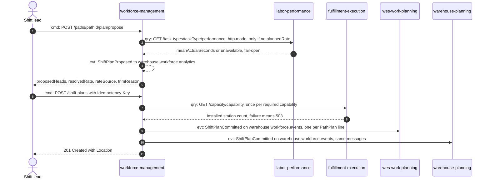
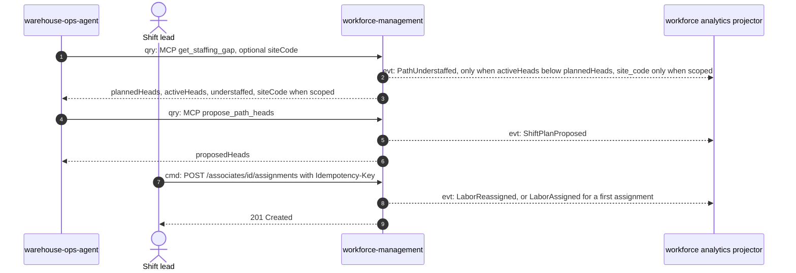
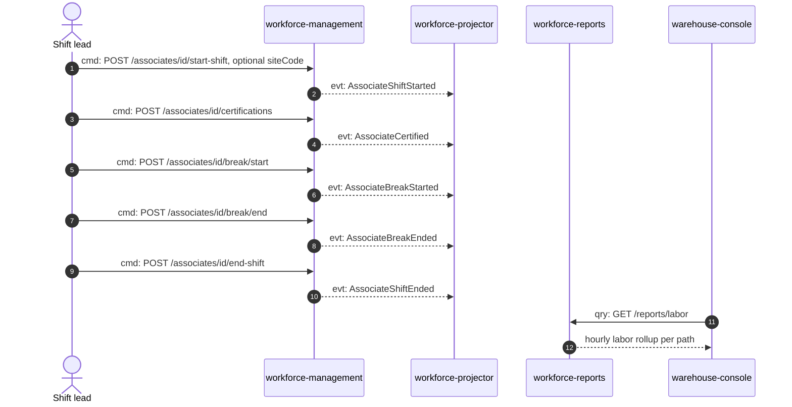
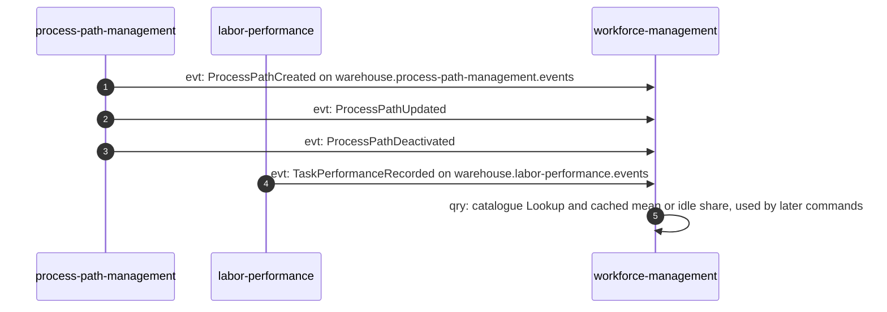

# Domain message flow

Follows ddd-crew
[Domain Message Flow Modelling](https://github.com/ddd-crew/domain-message-flow-modelling).
Every arrow is prefixed `cmd:` (command), `evt:` (event) or `qry:` (query)
and maps to a real REST route, MCP tool or CloudEvents `type`. Event names
are shortened to the last `type` segment inside the diagrams; the full
`type` strings are in [Domain events](./domain-events.md).

## 1. Shift-start planning: propose, then commit

A shift lead asks for a proposal, then commits a headcount split. The
proposal may read a measured rate; the commit must read live installed
capacity.

Source: `internal/application/usecases/propose_path_plan.go`,
`commit_shift_plan.go`, `internal/adapters/outbound/laborperformance/client.go`,
`internal/adapters/outbound/fulfillmentexecution/client.go`,
`internal/adapters/outbound/kafka/publisher.go`; consumers in
`wes-work-planning/internal/adapters/inbound/kafka/consumer.go` and
`warehouse-planning/internal/adapters/inbound/kafka/labor_capacity_consumer.go`.
Omits: the `kafka-cache` alternative to step 2 (scenario 4), the idle-share
trim lookup, the outbox relay hop, and every rejection branch.

## 2. Intra-shift rebalancing: see the gap, move someone

`warehouse-ops-agent` (or a lead on the console) reads the gap; the move
itself is a human call recorded through `AssignLabor`.

Source: `internal/adapters/inbound/mcp/tools.go`,
`internal/application/usecases/get_staffing_gap.go`, `assign_labor.go`,
`internal/adapters/outbound/kafka/analytics_publisher.go`;
`warehouse-ops-agent/internal/adapters/outbound/mcpclient/workforce_management.go`.
Omits: the MCP `assign_labor` tool (registered, but no sibling calls it in
code), the all-paths REST variant
`GET /buildings/buildingId/shifts/shiftId/staffing-gap`, and the rejection
branches (uncertified, on break, shift ended, max hours).

## 3. Associate day: roster, breaks, end of shift, reporting

Source: `internal/adapters/inbound/http/router.go`,
`internal/application/usecases/start_associate_shift.go`, `certify_associate.go`,
`breaks.go`, `end_associate_shift.go`,
`internal/adapters/inbound/kafka/analytics_consumer.go`,
`internal/adapters/inbound/http/reports_handler.go`;
`warehouse-console/src/features/context-reports/workforceManagement.config.tsx`.
Omits: `GET /reports/labor/freshness`, the `warehouse-ops-agent` reports
client that reads the same endpoint, and the DLQ (`warehouse.workforce.analytics.dlq`).

## 4. Reference data feeds into this context

Selected by `PATH_CATALOGUE_SOURCE=kafka` and
`LABOR_PERFORMANCE_MODE=kafka-cache`; the defaults are `file` and
`permissive`.

Source: `internal/adapters/outbound/kafkacatalog/consumer.go`,
`internal/adapters/outbound/laborperformancecache/consumer.go`,
`internal/adapters/kafka/cloudevents/types.go`, `cmd/workforce/main.go`.
Omits: the boot-time readiness wait (`WaitReadyTimeout`) and the
per-process consumer-group naming.
