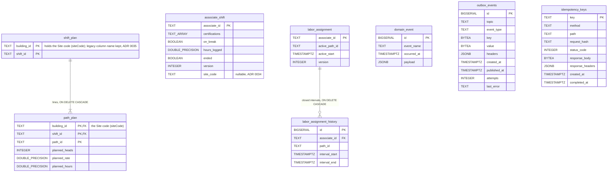
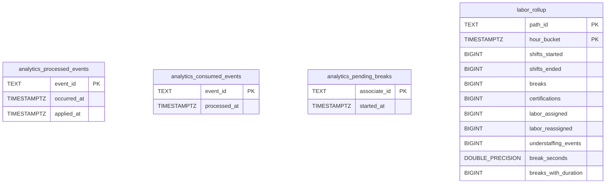

# Entity-relationship diagram

Two separate databases, two diagrams. Both show the **final** schema after
every migration is applied in order. A relationship line is drawn only where
a real `FOREIGN KEY` exists.

## OLTP database (`DATABASE_URL`)

Migrations `000001_init` → `000002_outbox` → `000003_version` →
`000004_idempotency_keys` → `000005_associate_shift_site_code`, applied by `cmd/workforce` (and `cmd/mcp`) on boot
through `MIGRATIONS_DATABASE_URL` ([ADR 0025](../adr/0025-migrations-direct-postgres-connection.md)).

Source: `migrations/000001_init.up.sql`, `000002_outbox.up.sql`,
`000003_version.up.sql`, `000004_idempotency_keys.up.sql`,
`000005_associate_shift_site_code.up.sql`. Omits: the
indexes (`idx_labor_assignment_active_path`,
`idx_associate_shift_site_code` (partial, non-NULL `site_code` only),
`idx_outbox_events_unpublished`, `idx_outbox_events_published_at`,
`idx_idempotency_keys_created_at`), column defaults, and golang-migrate's own
`schema_migrations` table. Types with spaces or brackets are written with
`_` (`DOUBLE_PRECISION`, `TEXT_ARRAY` for `TEXT[]`).

### Logical links without a foreign key

- `labor_assignment.associate_id` and `associate_shift.associate_id` hold the
  same `AssociateId` but are **not** linked: they are two aggregates, and
  `AssignLabor` / `EndAssociateShift` coordinate them in the application
  layer, not through the schema. The **site-scoped staffing gap** (ADR 0034)
  joins them by value at query time — `labor_assignment` ⨝ `associate_shift`
  on `associate_id`, `site_code = :siteCode AND ended = FALSE` — a read-side
  join, still not a constraint. `site_code` is `NULL` for every legacy row and
  for shifts started without a site; `NULL` matches no site, so those rows
  count only in unscoped queries. The code is accepted as given (no lookup in
  facility-layout).
- `path_plan.path_id`, `labor_assignment.active_path_id` and
  `labor_assignment_history.path_id` are process-path ids validated against
  the process-path catalogue at the adapter edge; the catalogue is not a
  table here.
- `outbox_events` and `idempotency_keys` reference nothing: they are written
  in the same transaction as the aggregate rows, which is the only coupling.

## Analytics database (`ANALYTICS_DATABASE_URL`)

Migration `migrations/analytics/0001_report.up.sql`, applied by
`cmd/workforce-projector`; read-only for `cmd/workforce-reports`.

Source: `migrations/analytics/0001_report.up.sql`. Omits: the two indexes.
There are no foreign keys in this schema at all.

## Table ≠ aggregate

| Table | Kind | Aggregate / role |
| --- | --- | --- |
| `shift_plan` + `path_plan` | aggregate state | `ShiftPlan` with its `PathPlan` lines; `Save` deletes and re-inserts the lines. The key column `building_id` stores the **Site code** — `siteCode` is the canonical name and `buildingId` its deprecated alias, one value, one column, **no migration** ([ADR 0035](../adr/0035-sitecode-converges-building-id.md)) |
| `associate_shift` | aggregate state | `AssociateShift` (certifications as a `TEXT[]`, not a child table; optional canonical `site_code`, [ADR 0034](../adr/0034-site-scoped-staffing-gap.md)) |
| `labor_assignment` + `labor_assignment_history` | aggregate state | `LaborAssignment`: active interval in the parent row, closed `Interval`s in the child |
| `domain_event` | legacy, unused; retained | Decided 2026-10-06: **keep** — created by `000001_init`, no production code reads or writes it; retained because migrations are additive only (dropping a table is destructive and needs explicit approval) |
| `outbox_events` | infrastructure | transactional outbox, one row per encoded Kafka message on either topic ([ADR 0016](../adr/0016-transactional-outbox.md)) |
| `idempotency_keys` | infrastructure | `Idempotency-Key` middleware store ([ADR 0027](../adr/0027-idempotency-key-middleware.md)), swept by housekeeping ([ADR 0028](../adr/0028-housekeeping-sweeper-idempotency-keys-and-outbox.md)) |
| `schema_migrations` | infrastructure | golang-migrate bookkeeping |
| `analytics_processed_events` | projection idempotency + freshness | analytics read side ([ADR 0010](../adr/0010-analytical-data-product.md)) |
| `analytics_consumed_events` | consumer dedupe (`ports.ProcessedEvents`) | analytics read side |
| `analytics_pending_breaks` | projection working state | analytics read side |
| `labor_rollup` | projection (fact table) | analytics read side, served by `GET /reports/labor` |

The `version` columns on `associate_shift` and `labor_assignment` are
optimistic-concurrency metadata ([ADR 0021](../adr/0021-optimistic-concurrency-version-column.md));
`shift_plan` deliberately has none.
