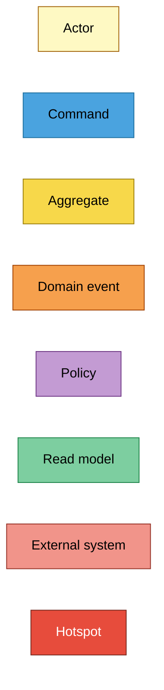
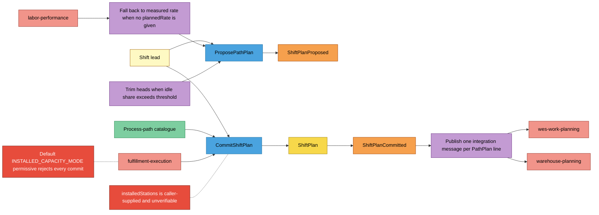
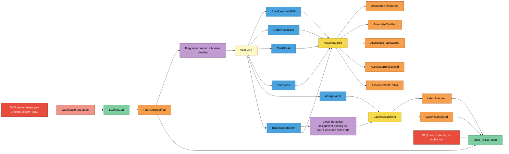

# EventStorming (design level)

Uses the sticky colours of the ddd-crew
[EventStorming glossary cheat sheet](https://github.com/ddd-crew/eventstorming-glossary-cheat-sheet).
Design level: every command, aggregate, event, policy and read model below
is a real identifier in this repository. Hotspots are gaps already recorded
in ADRs or code comments, not invented ones.

## Legend

## Process 1 — shift-start planning

Source: `internal/application/usecases/propose_path_plan.go`,
`commit_shift_plan.go`, `internal/domain/shiftplan/shift_plan.go`,
`internal/adapters/outbound/kafka/publisher.go`,
`internal/adapters/outbound/fulfillmentexecution/permissive.go`. Omits: the
analytics copy of every event, the outbox relay, and the rejection outcomes
(listed in [Invariants](./invariants.md)).

## Process 2 — intra-shift assignment and the associate day

Source: `internal/application/usecases/*.go`,
`internal/domain/associate/associate_shift.go`,
`internal/domain/assignment/labor_assignment.go`,
`internal/adapters/inbound/kafka/analytics_consumer.go`,
`migrations/analytics/0001_report.up.sql`. Omits: the MCP `assign_labor`
path into `AssignLabor` and the per-associate events' flow into
`labor_rollup` (all associate events project there too).

## Sticky inventory

| Sticky | Kind | Code evidence |
| --- | --- | --- |
| Shift lead | Actor | callers of the REST routes in `internal/adapters/inbound/http/router.go`; the console remote in `web/` |
| `ProposePathPlan` | Command | `usecases.ProposePathPlan`, `POST /paths/{pathId}/plan/propose`, MCP `propose_path_heads` |
| `CommitShiftPlan` | Command | `usecases.CommitShiftPlan`, `POST /shift-plans` |
| `StartAssociateShift`, `CertifyAssociate`, `StartBreak`, `EndBreak`, `EndAssociateShift` | Command | matching structs in `internal/application/usecases/` |
| `AssignLabor` | Command | `usecases.AssignLabor`, `POST /associates/{id}/assignments`, MCP `assign_labor` |
| `ShiftPlan`, `AssociateShift`, `LaborAssignment` | Aggregate | `internal/domain/{shiftplan,associate,assignment}` |
| the ten events | Domain event | `internal/domain/shared/events.go`; full `type` strings in `internal/adapters/kafka/cloudevents/types.go` |
| Fall back to measured rate | Policy | `ProposePathPlan.Execute` (`plannedRate <= 0` branch), [ADR 0012](../adr/0012-measured-rate-feed-for-propose-path-plan.md) |
| Idle-share trim | Policy | `ProposePathPlan.applyIdleShareTrim`, `IDLE_SHARE_TRIM_THRESHOLD` (default 0.30), [ADR 0020](../adr/0020-idle-share-staffing-signal.md) |
| One message per line | Policy | `kafka.Publisher.Encode` |
| Close active assignment on shift end | Policy | `EndAssociateShift.Execute` |
| Flag, never move | Policy | `shared.PathUnderstaffed` doc comment, [ADR 0002](../adr/0002-stop-at-the-path-boundary.md) |
| Process-path catalogue | Read model | `pathcatalog.Catalogue`, `filecatalog` / `kafkacatalog` adapters |
| `StaffingGap` | Read model | `usecases.StaffingGap` |
| `labor_rollup` report | Read model | `migrations/analytics/0001_report.up.sql`, `GET /reports/labor` |
| labor-performance, fulfillment-execution, wes-work-planning, warehouse-planning, warehouse-ops-agent | External system | `internal/adapters/outbound/{laborperformance,laborperformancecache,fulfillmentexecution}`; sibling consumers named in [Context map](../ecosystem/context-map.md) |
| `installedStations` unverifiable | Hotspot | `shiftplan.ErrExceedsInstalledCapacity` doc comment, [ADR 0014](../adr/0014-installed-capacity-ceiling.md) |
| Permissive capacity mode rejects every commit | Hotspot | `fulfillmentexecution.PermissiveClient` doc comment: a caller must opt into `INSTALLED_CAPACITY_MODE=http` to commit at all |
| DLQ without alerting or replay | Hotspot | [ADR 0022](../adr/0022-resilience-circuit-breakers-retry-dlq-shutdown.md) consequences ("out of scope") |
| MCP per-process session state | Hotspot | [ADR 0024](../adr/0024-horizontal-autoscaling-and-pgxpool-tuning.md) (`cmd/mcp` excluded from autoscaling) |
