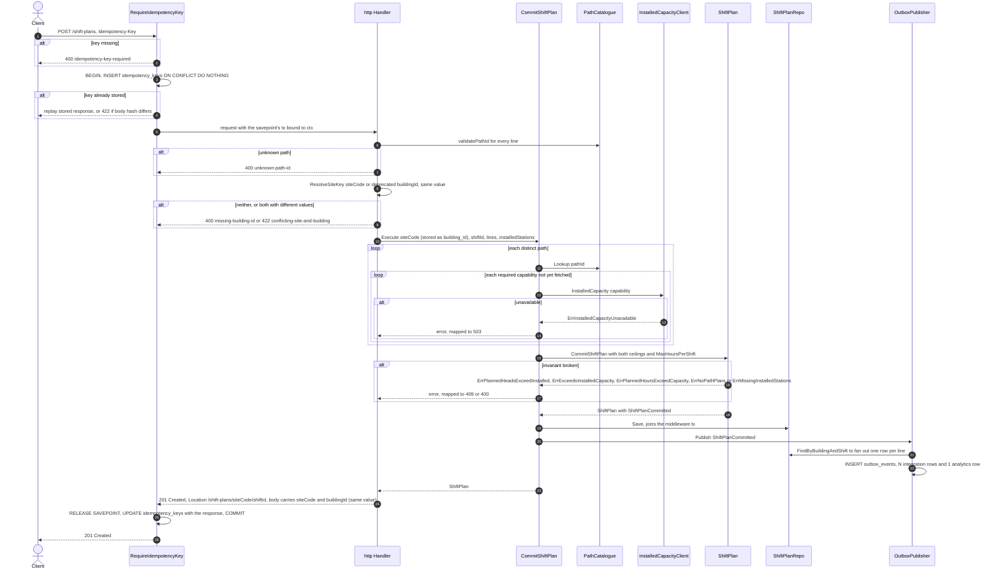
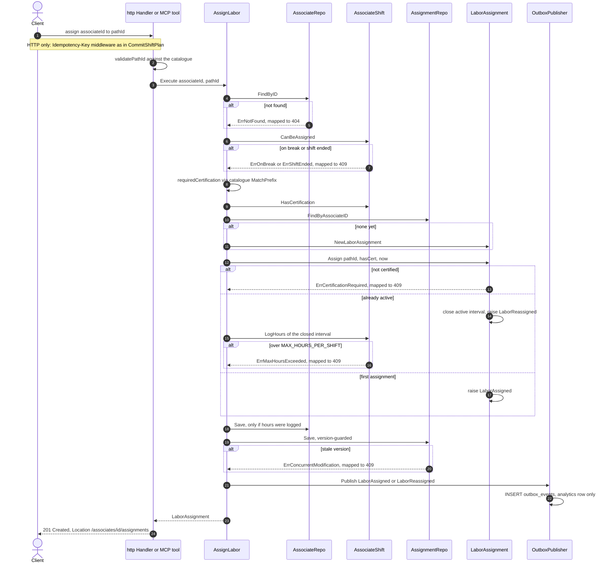
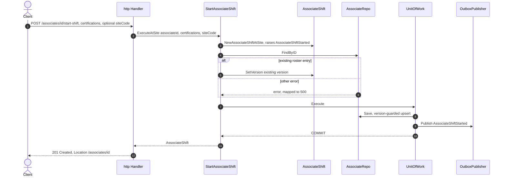
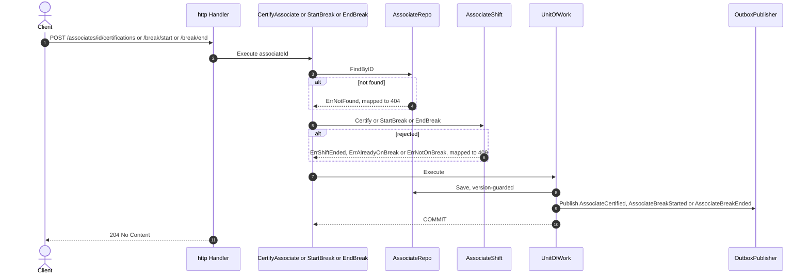
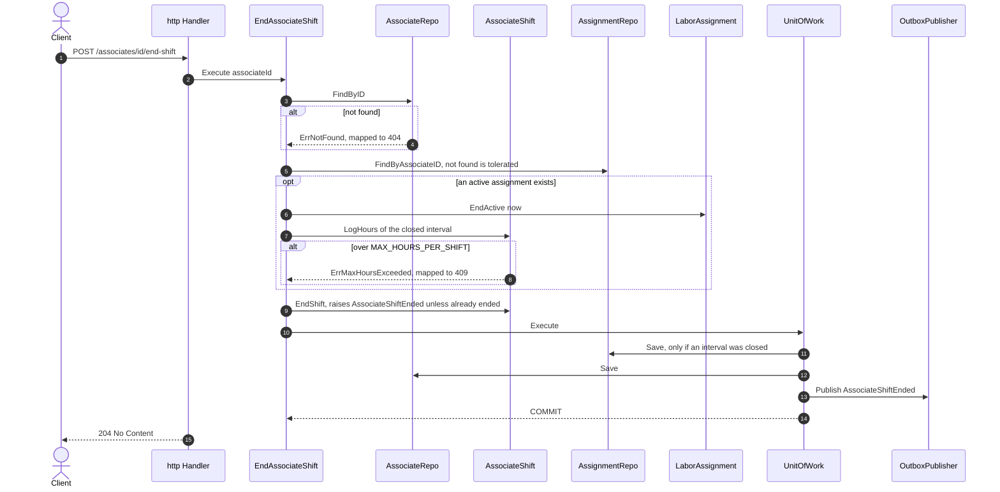
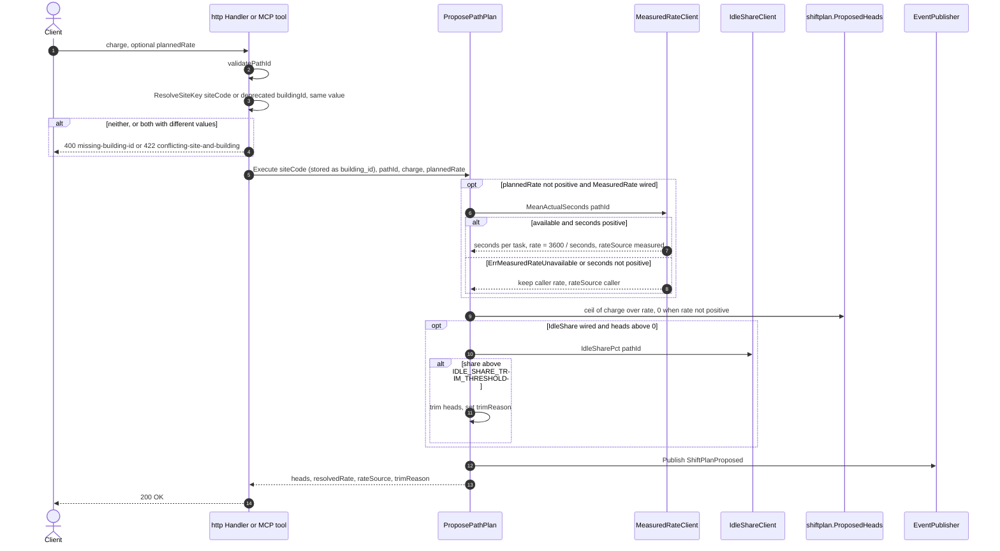
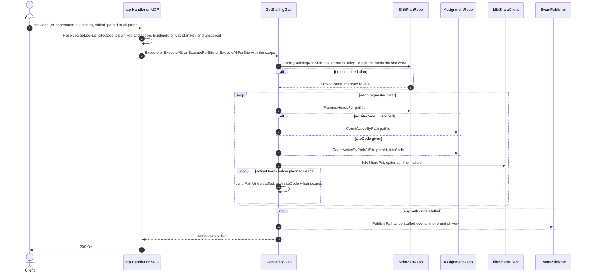

# Sequence diagrams

One diagram per command use case (the three single-aggregate associate
commands share one), plus the staffing-gap query because it publishes an
event. Each is traced from the `Execute` body in
`internal/application/usecases/` and the handler in
`internal/adapters/inbound/http/router.go`.

Shared facts every diagram relies on:

- **Unit of work.** Every use case wraps its `Save` calls and `Publish` in
  `atomically(ctx, UnitOfWork, fn)`. With Postgres wired, that is one
  transaction (`postgres.UnitOfWork`); if a transaction is already bound to
  the context — by the idempotency middleware — it joins that one instead.
  The middleware binds a savepoint inside its transaction and rolls back to
  it on any non-2xx response, so a late failure (a `409` on the second
  `Save`) cannot leave an earlier `Save` of the same request committed.
- **Outbox.** With `EVENT_PUBLISHER=kafka` and Postgres, `Publish` is
  `postgres.OutboxPublisher`: it encodes every event into CloudEvents rows for
  `warehouse.workforce.events` and `warehouse.workforce.analytics` and
  `INSERT`s them into `outbox_events` in the same transaction. The relay in
  `cmd/workforce` drains the table to Kafka later
  ([ADR 0016](../adr/0016-transactional-outbox.md)). With the default
  `EVENT_PUBLISHER=log`, events are only logged.
- **Version guard.** `AssociateRepo.Save` and `AssignmentRepo.Save` are
  `INSERT … ON CONFLICT DO UPDATE … WHERE version = loaded`; zero rows means
  `ports.ErrConcurrentModification` → `409`
  ([ADR 0021](../adr/0021-optimistic-concurrency-version-column.md)).
- **Errors** are mapped to RFC 7807 responses by `statusFor` in
  `internal/adapters/inbound/http/errors.go`.

## CommitShiftPlan — `POST /shift-plans`

Source: `internal/adapters/inbound/http/idempotency.go`, `router.go`
(`commitShiftPlan`), `internal/application/usecases/commit_shift_plan.go`,
`internal/domain/shiftplan/shift_plan.go`,
`internal/adapters/outbound/postgres/shift_plan_repo.go`, `outbox_publisher.go`,
`internal/adapters/outbound/kafka/publisher.go`. Omits: request-body decoding
errors, the `ErrCommitShiftPlanNoCatalogue` wiring error, and the circuit
breaker around the capacity client. The plan key is the canonical `siteCode`;
`buildingId` is accepted as a deprecated alias (same value, same
`building_id` column) and each published line message carries `site_code` next
to `building_id` ([ADR 0035](../adr/0035-sitecode-converges-building-id.md)). Every normal response, including a 4xx,
is stored against the key; only a panic rolls the key back. The wrapped
handler runs inside a savepoint: a 2xx releases it, any other status rolls
back to it first, so a failed request's domain writes and outbox rows are
discarded (no partial write) while the idempotency row still records the
failed response for replay.

## AssignLabor — `POST /associates/{id}/assignments` and MCP `assign_labor`

Source: `internal/application/usecases/assign_labor.go`, `metrics.go`,
`internal/adapters/inbound/http/router.go` (`assignLabor`),
`internal/adapters/inbound/mcp/tools.go` (`assignLabor`),
`internal/domain/assignment/labor_assignment.go`,
`internal/adapters/outbound/postgres/assignment_repo.go`. Omits: the
deferred `recordLaborAssignment` call that counts every attempt on
`workforce.labor_assignments`, and the MCP error-to-tool-result mapping.

## StartAssociateShift — `POST /associates/{id}/start-shift`

Source: `internal/application/usecases/start_associate_shift.go`,
`internal/domain/associate/associate_shift.go`,
`internal/adapters/outbound/postgres/associate_repo.go`, `unit_of_work.go`.
Omits: request validation (`ErrEmptyAssociateId`, `ErrEmptyCertification` →
400). Not behind the idempotency middleware: restarting is an upsert by
associate id. The optional `siteCode` ([ADR 0034](../adr/0034-site-scoped-staffing-gap.md))
is trimmed, accepted as given (no lookup in facility-layout) and persisted as
`associate_shift.site_code` (`NULL` when absent); a restart replaces it.
`Execute` (no site) is the same call with an empty site.

## CertifyAssociate, StartBreak, EndBreak

The three share one shape; only the aggregate method and event differ.

Source: `internal/application/usecases/certify_associate.go`, `breaks.go`,
`internal/domain/associate/associate_shift.go`. Omits: request decoding of
the certification body.

## EndAssociateShift — `POST /associates/{id}/end-shift`

Source: `internal/application/usecases/end_associate_shift.go`. Omits:
nothing material; `EndActive` raises no event of its own.

## ProposePathPlan — `POST /paths/{pathId}/plan/propose` and MCP `propose_path_heads`

Source: `internal/application/usecases/propose_path_plan.go`,
`internal/domain/shiftplan/shift_plan.go` (`ProposedHeads`). Omits: the
circuit breaker and retry around the HTTP measured-rate client. Nothing is
persisted except the outbox row for the event.

## GetStaffingGap — `GET /paths/{pathId}/staffing-gap` and the all-paths variant

Source: `internal/application/usecases/get_staffing_gap.go`,
`internal/adapters/inbound/http/router.go` (`staffingGap`,
`staffingGapForSiteShift`, `staffingGapForShift`),
`internal/adapters/inbound/mcp/tools.go`, `resources.go`. Omits:
query-parameter validation (neither `siteCode` nor `buildingId`, or no `shiftId`
→ 400). **Resolved (Decided 2026-10-06, [ADR 0034](../adr/0034-site-scoped-staffing-gap.md),
[ADR 0035](../adr/0035-sitecode-converges-building-id.md)):**
`CountActiveByPath` still counts every active assignment on the path across
sites — that is the **unscoped** answer, which is what a call that sends only
the legacy `buildingId` gets (callers use ids like `bldg-1`, not Site codes).
With a `siteCode`, which is both the plan key and the scope,
`CountActiveByPathAtSite` counts
only assignments whose associate has a not-ended shift at that site
(`labor_assignment` ⨝ `associate_shift`); legacy `NULL`-site rows never match a
site. Routes: `GET /sites/{siteCode}/shifts/{shiftId}/staffing-gap` is
canonical; `GET /buildings/{buildingId}/shifts/{shiftId}/staffing-gap` is the
deprecated alias (`Deprecation: true`, unscoped unless `?siteCode=`). MCP
resource `staffing://sites/{siteCode}/{shiftId}/{pathId}/gap` is scoped;
`staffing://{buildingId}/…/gap` stays unscoped and deprecated.
